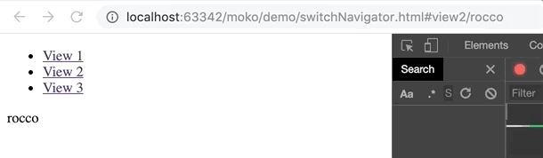
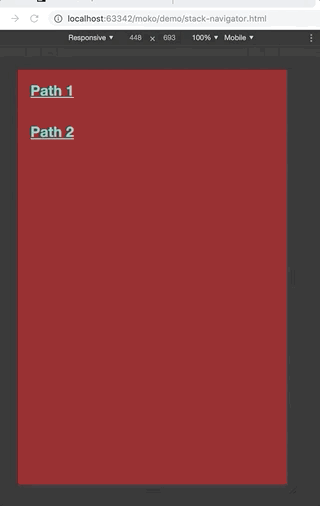

# Moko

Moko is a lightweight WebComponents based navigation library
highly inspired by [React Navigation](https://reactnavigation.org).

It supports three kinds of navigators:

- switch navigator
- stack navigator
- tab navigator

##Switch navigator

Switch navigator only show one content at a time, each route displaying a different content. Content is not cached



Code example:

```html
<moko-switch-navigator>
  <moko-route path="view1/:name" component="demo-view1">
    <span>diego</span>
  </moko-route>
  <moko-route path="view2/:name" component="demo-view2"></moko-route>
  <moko-route path="view3/:name" component="demo-view3"></moko-route>
</moko-switch-navigator>
```

A navigator contains multiple `<moko-route>`. A route has two mandatory attributes `path` and `component`.

- `path` associates the route to an url fragment. Each time an url match that path, the content associated with that route will be displayed. The path can contain placeholders
- `component` name of the Web Component that will be displayed when an url match the route's path.

Navigation is triggered either with standard `<a href="#some-route">Click</a>` or with safer moko provided custom element
`<moko-link to="some-route""></moko-link>`. `moko-link` supports navigator nesting.

If the url fragment is empty, the first route will be rendered.

By default a navigator will take all space available in his node ancestor.

### Server side rendering

First `moko-route` element can contain markup that will be displayed before corresponding web component is rendered properly.
It allows to server side render content and make the page SSO friendly.

### Demo

See [switchNavigator.html](./demo/switchNavigator.html) for a complete example.

## Stack navigator

Stack navigator will display new content on top of previous one while navigating.



Code example:

```html
<moko-stack-navigator>
  <moko-route path="path1" component="demo-el1"></moko-route>
  <moko-route path="path2" component="demo-el2"></moko-route>
  <moko-route path="path3" component="demo-el3"></moko-route>
</moko-stack-navigator>
```

## Tab navigator

Tab navigator will display a tabbar at the bottom of the screen. Each click on a tab entry will
display different content.


Each of those are available as custom elements through ES6 modules (see the [dist](https://github.com/dsolimando/moko/tree/master/dist) folder).

## Examples

Please explore the [demo](https://github.com/dsolimando/moko/tree/master/demo) folder to find various code examples.

[Live Demo](https://dsolimando.github.io/moko/demo/demo.html)
